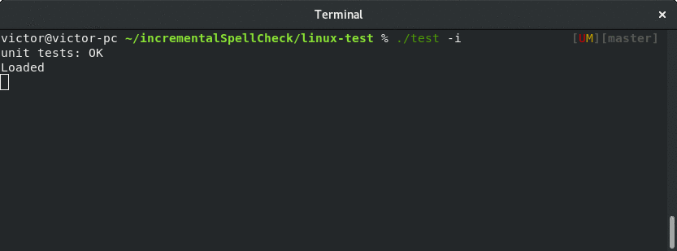

## Incremental search and spell checker in C++

This is C++ header-only implementation of incremental search within a list of captions (menu, articles, etc) with misprint corrections support. 

## Demo



## Contents

 * [incrementalSearch.hpp](incrementalSearch.hpp) - search implementation
 * [spellCheck.hpp](spellCheck.hpp) - spelling checker using Optimal String Alignment distance (a variation of [Damerau–Levenshtein distance](https://en.wikipedia.org/wiki/Damerau%E2%80%93Levenshtein_distance)) with optional modification for better incremental search matching
 * [test.cpp](test.cpp) - a kind of tests and usage example.
 * [msvc-test](msvc-test) - test solution for MSVC 2015 and higher
 * [linux-test](linux-test) - Linux Makefile
 * getch.cpp, getch.h - a stub for similar getch() on windows and Linux
 * [list of Wikipedia core articles](https://github.com/victor-istomin/incrementalSpellcheck/blob/master/incrementalSpellcheck/wikipedia.txt) is used as text to perform search in

## Usage

 ```cpp
 #include "incrementalSearch.hpp"
 void f()
 {
     std::vector<std::string> listOfTopics = {...};
     IncrementalSearch search { listOfTopics };
     
     const std::string& closestMatchedTopic = search.search('misprint');     
 }
 
 // or:
 #include "spellCheck.hpp"
 void g()
 {
     const char* textCorpus[] = {"one two, three", "Four.Five", "verylongword"};
     SpellCheck speller { textCorpus };
     
     const size_t maxCount = 2;
     auto corrections = speller.getCorrections("tree", maxCount);                  // "three"
     auto incrementalCorrections = speller.getCorrections("_ery", maxCount, true); // "_ery" -> "very.*" -> "verylongword"
 }
 
 void h()
 {
      SpellCheck::getSmartDistance("abcde", "abc"); // == 2
      SpellCheck::getSmartDistance(CString("abcde"), std::string("abcd"));

      SpellCheck::getSmartDistance("abcde", "abc", true/*incremental*/); // == 0, "abc" -> "abc.*" -> "abcde"
 }
 ```

 ## Supported compilers

C++ 14 with at least partial expression SFINAE is needed. Testsed on:
  * Visual Studio 2015 update 3
  * gcc 7.2

 See [test.cpp](test.cpp) for more detailed examples.
